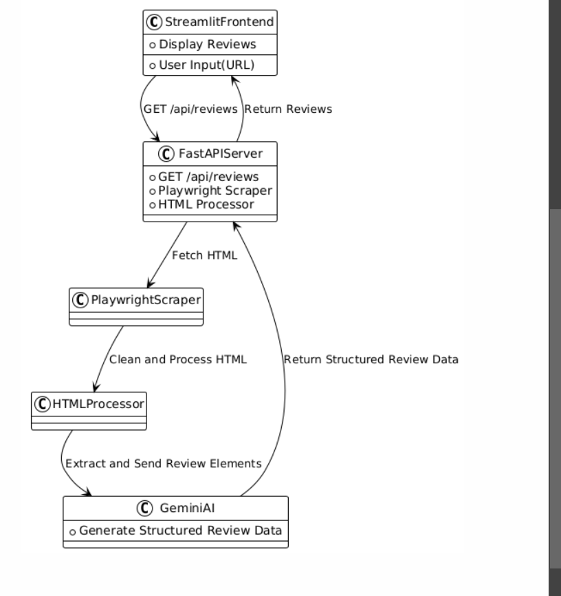

# GoMarble

GoMarble is a review scraping application that uses a web interface built with Streamlit and a backend API built with FastAPI. The application scrapes product reviews from a given URL and processes them using the Gemini AI.

## Solution Approach

The project consists of two main components:
1. **Frontend**: A Streamlit application that provides a user-friendly interface for entering product URLs and displaying scraped reviews.
2. **Backend**: A FastAPI application that handles scraping the reviews from the provided URL and processing them using the Gemini AI.

### Detailed Solution Approach

1. **Streamlit Frontend**:
    - User enters the product URL into the input field.
    - On clicking the "Get Reviews" button, the frontend makes a GET request to the FastAPI backend with the provided URL.
    - The response from the backend is displayed in the Streamlit application.

2. **FastAPI Backend**:
    - The FastAPI backend receives the GET request with the product URL.
    - The backend uses Playwright to scrape the HTML content of the product page.
    - The HTMLProcessor class cleans and processes the HTML to extract review elements.
    - The extracted review elements are sent to the Gemini AI to generate structured review data.
    - The backend returns the structured review data to the frontend.

## System Architecture



### Streamlit Frontend

- **User Input (URL)**:
    - Users enter the URL of the product for which they want to scrape reviews.
    
- **Display Reviews**:
    - The reviews fetched from the backend are displayed here.

### FastAPI Server

- **GET /api/reviews**:
    - The endpoint receives the URL from the frontend and processes the request.
    
- **Playwright Scraper**:
    - This component uses Playwright to fetch the HTML content of the specified URL.
    
- **HTML Processor**:
    - Processes and cleans the HTML content to extract review elements.

### Gemini AI

- **Generate Structured Review Data**:
    - The extracted review elements are sent to Gemini AI, which generates structured review data.


## Instructions on How to Run the Project

1. **Clone the repository**:
    ```sh
    git clone https://github.com/Ullasgsagar563/GoMarble.git
    cd GoMarble
    ```

2. **Install the dependencies**:
    ```sh
    pip install -r requirements.txt
    ```

3. **Set up environment variables**:
    Create a `.env` file in the root directory and add your Gemini API key:
    ```env
    GEMINI_API_KEY=your_gemini_api_key
    ```

4. **Run the FastAPI backend**:
    ```sh
    main.py
    ```

5. **Run the Streamlit frontend**:
    ```sh
    streamlit run my/app.py
    ```

6. **Access the application**:
    - Open your browser and go to `http://localhost:8501` to access the Streamlit interface.
    - Enter a product URL and click the "Get Reviews" button to fetch and display reviews.

## Examples

### API Usage
You can directly interact with the FastAPI backend by making a GET request to the following endpoint:

- **Endpoint**: `GET /api/reviews`
- **Query Parameter**: `url` (The product URL to scrape reviews from)

**Example Request**:
```sh
curl -X GET "http://localhost:8000/api/reviews?url=https://example.com/product"
```
 **Example Response:**
 ```sh
 {
  "reviews_count": 10,
  "reviews": [
    {
      "title": "Great Product!",
      "body": "I really enjoyed using this product. Highly recommended!",
      "rating": 5,
      "reviewer": "John Doe"
    },
    {
      "title": "Not bad",
      "body": "The product is okay, but could be improved.",
      "rating": 3,
      "reviewer": "Jane Smith"
    }
  ]
}
```
